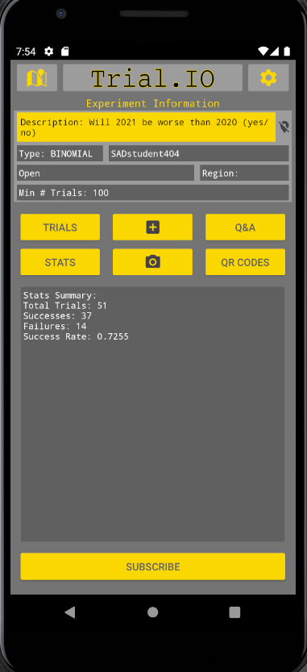

# trialio

## What is it?
Trialio is a easy-to-use mobile application that allows crowd-sourced testing of phenomona. There are 4 kinds of crowd-sourced tests: counts (how many did you see), binomial trials (pass fail), non-negative integer counts (each trial has 0 or more), measurement trials (like the temperature).

## How does it work?
A new user profile will be generated the first time that a user launches the app on a new device. With their profile, the user can create and publish new experiments, browse experiments created by other users, execute and upload trials to existing experiments, and much more.

For a complete list of features, please check out the full project problem description in the wiki.

This app was built using Java, Android and Firebase. This was a group project completed for CMPUT 301 Winter 2021.